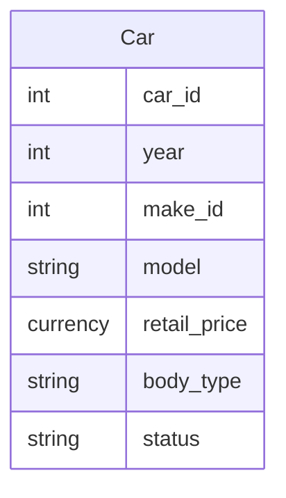

# Car Table

This table manages all the available cars that are part of the inventory, e.g., `2014 Ford Edge` or `2011 Honda Accord`.

**Primary Key(s)**: car_id

**Foreign Key(s)**: make_id

## Fields

### car_id

**Type**: Long Integer, AutoNumber

**Description**: The unique identifier of the record

### year

**Type**: Long Integer

**Description**: The year of the car

### make_id

**Type**: Long Integer, Lookup

**Description**: Foreign key relationship to the `Make Table`, determines what the make of the car is, e.g. `Ford`

**Row Source Type**: Table/Query

**Row Source**: `SELECT [Make Table].make_id, [Make Table].name FROM [Make Table] ORDER BY [name];`

### model

**Type**: Short Text

**Size**: 255

**Description**: The name of the model, e.g., Edge or Accord

### retail_price

**Type**: Currency

**Description**: The selling price of the car

### body_type

**Type**: Short, Lookup

**Description**: The body style of the car

**Row Source Type**: Value List

**Row Source**: `Convertible`, `Coupe`, `Hatchback`, `Minivan`, `Pickup Truck`, `Sedan`, `Sports Car`, `Sport-Utility Vehicle (SUV)` and `Station Wagon`

### status

**Type**: Short, Lookup

**Description**: Determines if the car is still available for purchase

**Row Source Type**: Value List

**Row Source**: `Active` and `Inactive`

## Relationships

[Make Table Car Table](Database-Table-Relationships.md)
