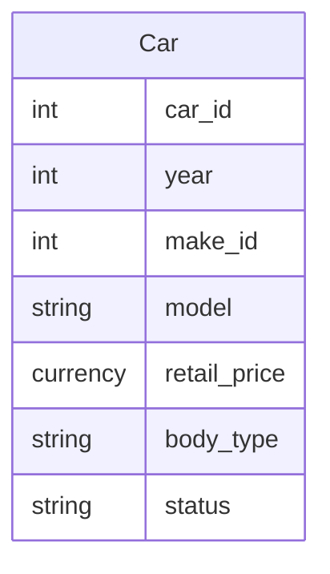

# Car Table

This table manages all the available cars that are part of the inventory, e.g., `2014 Ford Edge` or `2011 Honda Accord`.

Microsoft Access Properties

* **Name**: Car Table
* **Primary Key(s)**: car_id
* **Foreign Key(s)**: make_id

Dataverse Properties

* **Name**: Car
* **Unique Primary Column**: Model

## Fields

The fields that make up this table.

### car_id

Microsoft Access Properties

* **Type**: Long Integer, AutoNumber
* **Description**: The unique identifier of the record

Microsoft Dataverse Properties

* **Name**: Old Car Id
* **Type**: Whole number
* **Required**: Optional
* **Description**: The Microsoft Access unique identifier of the record

### year

Microsoft Access Properties

* **Type**: Long Integer
* **Description**: The year of the car

Microsoft Dataverse Properties

* **Name**: Year
* **Type**: Whole number
* **Required**: Optional
* **Description**: Same as Microsoft Access Property

### make_id

Microsoft Access Properties

* **Type**: Long Integer, Lookup
* **Description**: Foreign key relationship to the `Make Table`, determines what the make of the car is, e.g. `Ford`
* **Row Source Type**: Table/Query
* **Row Source**: `SELECT [Make Table].make_id, [Make Table].name FROM [Make Table] ORDER BY [name];`

Microsoft Dataverse Properties

* **Name**: Old Make Id
* **Type**: Whole number
* **Required**: Optional
* **Description**: Same as Microsoft Access Property

Note: Create a Many-to-one relationship with Make Table.

### model

Microsoft Access Properties

* **Type**: Short Text
* **Size**: 255
* **Description**: The name of the model, e.g., Edge or Accord

Microsoft Dataverse Properties

* **Name**: Model
* **Type**: Single line of text
* **Required**: Business required
* **Description**: Same as Microsoft Access Property

### retail_price

Microsoft Access Properties

* **Type**: Currency
* **Description**: The selling price of the car

Microsoft Dataverse Properties

* **Name**: Price
* **Type**: Currency
* **Required**: Optional
* **Description**: Same as Microsoft Access Property

### body_type

Microsoft Access Properties

* **Type**: Short, Lookup
* **Description**: The body style of the car
* **Row Source Type**: Value List
* **Row Source**: `Convertible`, `Coupe`, `Hatchback`, `Minivan`, `Pickup Truck`, `Sedan`, `Sports Car`, `Sport-Utility Vehicle (SUV)` and `Station Wagon`

Microsoft Dataverse Properties

* **Name**: Body Type
* **Type**: Choice
* **Required**: Optional
* **Description**: Same as Microsoft Access Property

Note: Create Choices called Car Body Type and populate with values from the Row Source for the Microsoft Access property, e.g. Convertible. Make sure to name them correctly.

### status

Microsoft Access Properties

* **Type**: Short, Lookup
* **Description**: Determines if the car is still available for purchase
* **Row Source Type**: Value List
* **Row Source**: `Active` and `Inactive`

Microsoft Dataverse Properties

* **Name**: Old Status
* **Type**: Single line of text
* **Required**: Optional
* **Description**: Same as Microsoft Access Property

## Relationships

The relationships between tables in the database, that includes this table.

[Make Table Car Table](Database-Table-Relationships.md)
