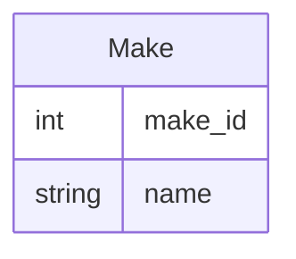

# Make Table

This table manages all the available makes that can be associated with a car, e.g., `Ford` or `Honda`.

Microsoft Access Properties

* **Name**: Make Table
* **Primary Key(s)**: make_id
* **Foreign Key(s)**: N/A

Dataverse Properties

* **Name**: Make
* **Unique Primary Column**: Name

## Fields

The fields that make up this table.

### make_id

Microsoft Access Properties

* **Type**: Long Integer, AutoNumber
* **Description**: The unique identifier of the record

Microsoft Dataverse Properties

* **Name**: Old Make Id
* **Type**: Whole number
* **Required**: Optional
* **Description**: The Microsoft Accesss unique identifier of the record

### name

Microsoft Access Properties

* **Type**: Short Text
* **Size**: 255
* **Description**: The name of the make, e.g., Ford or Honda

Microsoft Dataverse Properties

* **Name**: Name
* **Type**: Single line of text
* **Required**: Business required
* **Description**: Same as Microsoft Access Property

## Relationships

The relationships between tables in the database, that includes this table.

[Make Table Car Table](Database-Table-Relationships.md)
