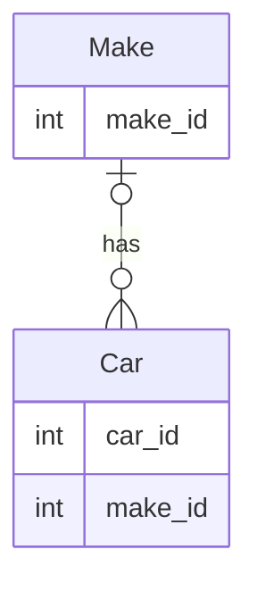

# Relationships

The relationships between tables in the database.

## Make Table Car Table

```mermaid
erDiagram
    Make |o--o{ Car : has 
    Make {
        int make_id
    }
    Car {
        int car_id
        int make_id
    }

```

**Attributes**: Enforced

**Relationship Type**: One-To-Many
