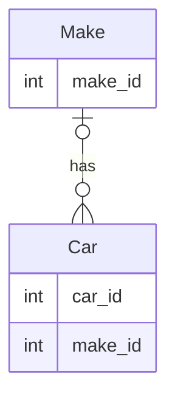

# Lab 2 - Migrate the Access database to Dataverse

This will be based on the `CarDatabase.accdb` included in this repository.

The first thing we will want to do is inventory all the objects, including tables, forms, report, etc. that are being used in the database.

Here is an example of what a sample Database Inventory report might look like.

## Database

**Database Name**: `CarDatabase.accb`

**Purpose**: `Manages car inventory for a local car dealership.`

**Estimated Number of Users**: `30`

This is the total number of team members using the Microsoft Access database.

**Estimated Number of Simultaneous Users**: `10`

This is the total number of team member who are using the Microsoft Access database at the same time.

## Tables

**Table Name**: Make

**Purpose**: To manage all the available makes that can be associated with a car, e.g., `Ford` or `Honda`.

**Primary Key**: `make_id`

### Fields

**Field Name**: `make_id`

**Type**: `Long Integer`, `AutoNumber`

#### Relationships

**Relationship Name**: `Make Table Car Table`

**Attributes**: `Enforced`

**Relationship Type**: `One-To-Many`
