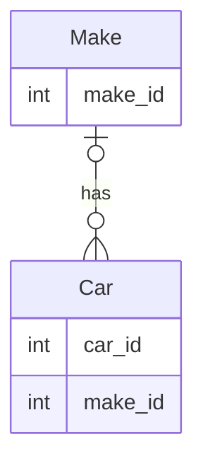

# Make Table

This table manages all the available makes that can be associated with a car, e.g., `Ford` or `Honda`.

**Primary Key(s)**: make_id

## Fields

### make_id

**Type**: Long Integer, AutoNumber

**Description**: The unique identifier of the record.

### name

**Type**: Short Text

**Size**: 255

**Description**: The name of the make, e.g., Ford or Honda.

## Relationships

### Make Table Car Table

**Attributes**: Enforced

**Relationship Type**: One-To-Many
